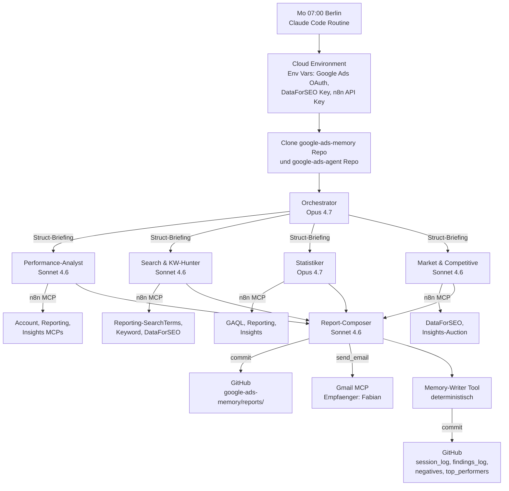

# Architektur — google-ads-agent

## Uebersicht

Multi-Agent-System nach Anthropic's Orchestrator-Worker-Pattern. Lead-Agent (Opus 4.7) koordiniert 4 parallele Sub-Agents (Sonnet 4.6 / Opus 4.7), Report-Composer synthetisiert. Memory-Koordination via Filesystem (GitHub-Repo).

**Quelle des Patterns:** Anthropic, "How we built our multi-agent research system" (2025) — dokumentiert 90% Performance-Gain ggu. Single-Agent bei Research-Tasks.

## Laufzeit-Topologie



## Daten-Flow (detailliert)

### Phase A — Bootstrap (Orchestrator)
1. Routine startet, klont `google-ads-memory` und `google-ads-agent` Repos
2. Orchestrator liest (via File-System):
   - `memory/00_strategy_manifest.md` — B2B-Regeln, Target-CPA, No-Gos
   - `memory/02_findings_log.md` — offene Items aus Vorwoche
   - `skills/weekly-report/SKILL.md` — Dispatch-Logik
3. Orchestrator plant Reporting-Umfang (welche Sub-Agents brauche ich, welche Zeitfenster)

### Phase B — Parallel-Dispatch (4 Sub-Agents)
Orchestrator nutzt `Task`-Tool, um 4 Sub-Agents parallel zu triggern. Jeder bekommt strukturiertes JSON-Briefing (siehe `handoff-contracts.md`). Kein Sub-Agent wartet auf einen anderen.

#### Performance-Analyst
- **Zeitfenster:** LAST_7_DAYS (default)
- **MCPs:** Account, Reporting (campaign/ad/keyword/device/geo/hourly/budget_pacing), Insights (top_campaigns)
- **Output-JSON:**
  ```json
  {
    "exec_kpis": { "spend", "conversions", "cpa", "conv_rate", "ctr", "wow_delta" },
    "campaigns": [ { "name", "status_color", "spend", "conv", "cpa", "is_lost_budget", "is_lost_rank" } ],
    "ads": { "rsa_strength_distribution", "top_5_by_conv", "bottom_5_by_ctr", "asset_performance" },
    "dimensions": { "device", "geographic", "hourly" },
    "budget_pacing": { "burn_rate", "forecast", "pacing_status" },
    "quality_score": { "distribution", "trend_wow" }
  }
  ```

#### Search & Keyword-Hunter
- **Zeitfenster:** LAST_14_DAYS (laengere Fenster fuer Search-Terms)
- **MCPs:** Reporting (search_terms), Keyword (list/get), DataForSEO (keyword_suggestions, related_keywords)
- **Output-JSON:**
  ```json
  {
    "negatives_candidates": [ { "term", "impressions", "spend", "conv", "category", "priority" } ],
    "keyword_opportunities": [ { "keyword", "search_volume", "competition", "rationale" } ],
    "ad_copy_audit": { "underperforming_rsas", "headline_patterns" },
    "money_burners": [ { "keyword", "spend", "conv": 0 } ],
    "high_performers_skalierbar": [ { "keyword", "cpa", "conv", "is_lost_budget" } ]
  }
  ```

#### Statistiker (eigener MCP-Zugriff)
- **Zeitfenster:** adaptiv — startet mit 7d, erweitert auf 14d/30d falls Sample-Size inadequat
- **MCPs:** GAQL (execute_gaql, search_stream), Reporting, Insights
- **Arbeitsweise:**
  1. Liest `memory/02_findings_log.md` — welche offenen Hypothesen aus Vorwochen?
  2. Zieht selbst Rohdaten (nicht vom Orchestrator durchgereicht)
  3. Fuehrt Tests durch (Z-Test fuer CVR, Welch-t-Test fuer CPA, Cochran-Armitage fuer Trends)
  4. Multiple-Testing-Korrektur (Bonferroni/FDR) ab 3+ parallele Tests
  5. Sample-Size-Adequacy-Check und Power Analysis
- **Output-JSON:**
  ```json
  {
    "significance_matrix": [
      { "hypothesis", "n", "test", "p_value", "ci_95", "effect_size", "verdict" }
    ],
    "multiple_testing_correction": "bonferroni | fdr | none",
    "weekday_correction_applied": true,
    "power_warnings": [ { "hypothesis", "n_actual", "n_required" } ],
    "open_hypotheses_resolved": [ { "id_from_findings_log", "new_verdict" } ],
    "trend_breaks": [ { "metric", "weeks_analyzed", "chisq", "p_value" } ]
  }
  ```

#### Market & Competitive
- **Zeitfenster:** LAST_30_DAYS (DataForSEO-Marktdaten sind langsamer)
- **MCPs:** DataForSEO (keyword_overview, search_volume, competitors_domain, serp_search, ranked_keywords), Insights (auction_insights via GAQL)
- **Output-JSON:**
  ```json
  {
    "auction_insights": [ { "competitor", "impression_share_delta", "position_delta" } ],
    "kw_volume_trends": [ { "keyword", "volume_now", "volume_trend_3m", "direction" } ],
    "new_competitors": [ { "domain", "kw_overlap", "avg_position" } ],
    "new_kw_opportunities": [ { "keyword", "volume", "cpc", "relevance_score" } ]
  }
  ```

### Phase C — Synthesis (Report-Composer)
1. Orchestrator sammelt 4 JSON-Outputs + Statistiker-Signifikanz-Matrix
2. Uebergibt strukturiert an Report-Composer
3. Composer rendert `skills/weekly-report/template.md` mit den Daten
4. Validiert gegen 12-Sektionen-Schema
5. Commit in `google-ads-memory/reports/YYYY-WNN-report.md`

### Phase D — Delivery & Memory-Update
1. Composer ruft Gmail-MCP-Tool `send_email` auf (Body = Executive Summary, Link auf GitHub-Report)
2. Memory-Writer-Tool (deterministisch, kein LLM):
   - Append Session-Entry in `01_session_log.md` (max. 12 rollierend)
   - Update `02_findings_log.md` — neue Hypothesen, resolved Hypotheses
   - Append neue Negatives in `03_negatives.md` (dedupliziert)
   - Append neue Top-Performers in `04_top_performers.md`
3. Push to GitHub

## Koordinations-Mechanismus

**Primaer: Filesystem (laut Anthropic Research).**
- Sub-Agents schreiben ihre Outputs in Claude Code Session-Files
- Orchestrator sammelt via Task-Tool-Results
- Finale Outputs (Report + Memory-Updates) via Git-Commits

**Kein:** Direkter Message-Bus zwischen Sub-Agents. Jeder hat eigenen isolierten Context. Koordination nur ueber Orchestrator.

## Kontext-Fenster-Strategie

| Agent | Context | Begruendung |
|---|---|---|
| Orchestrator | Memory + Sub-Agent-Outputs | Muss "alles" sehen fuer Synthesis |
| Performance-Analyst | Struct-Briefing + MCP-Responses | Isoliert, nur eigene Daten |
| Search & KW-Hunter | Struct-Briefing + Search-Terms-Raw | Isoliert, grosse Daten-Mengen |
| Statistiker | Struct-Briefing + Findings-Log + eigene GAQL-Responses | Eigener Fokus, keine Cross-Pollution mit Performance-Details |
| Market & Competitive | Struct-Briefing + DataForSEO-Responses | Isoliert |
| Report-Composer | Struct-JSONs von 4 Sub-Agents + Template | Minimal, nur Rendering |

## Fehler-Handling

- **MCP-Timeout:** Retry x2, dann Fallback auf kuerzeres Zeitfenster (LAST_7_DAYS -> LAST_3_DAYS)
- **Data-Freshness >36h:** Warning im Report (Sektion 8 — Appendix)
- **Sample-Size inadequat (<30 conversions):** Statistiker flaggt Hypothese, bleibt in Findings-Log fuer naechste Woche
- **Sub-Agent-Timeout:** Composer markiert betroffene Sektion als "❗ DATA UNAVAILABLE", Rest des Reports geht raus
- **Gmail/GitHub-Failure:** Report wird trotzdem erzeugt, Session-URL wird manuell von Fabian abgerufen

## Was in Phase 1 noch NICHT implementiert ist

- `.claude/agents/*.md` — kommt in Phase 4
- `skills/weekly-report/` — kommt in Phase 4
- `memory/` Git-Submodule — kommt in Phase 3
- `routines/weekly-report.md` — kommt in Phase 6
- Die 9 n8n-MCP-JSONs in `workflows/` — kommen in Phase 2
- DataForSEO-MCP-Workflow — kommt in Phase 2
